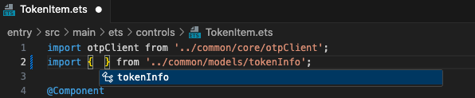

# ArkTs Tools
<a href="./README.md">中文</a>

This is the extension for ArkTs Language. Fast way to create, init, build and run ArkTs project.

## Requirements

VsCode version >= 1.75.0

## Extension Settings

This extension contributes the following settings:

- `arktsTools.hosSdkPath`: The absolute path to HarmonyOS Sdk.
- `arktsTools.ohosSdkPath`: The absolute path to OpenHarmony Sdk.
- `arktsTools.commandToolsPath`: The absolute path to Command Line Tools.
- `arktsTools.codelinterCheckAfterSave`: Run codelinter after save text document.
- `arktsTools.codelinterReloadChange`: Refresh struct after file/resources/folder change.
- `arktsTools.intellisensesModulesPath`: The absolute path to intellisenses modules roles. WARNING! The Location MUST be a FOLDER and file name MUST like "ets*role*\*\*\*.json".

## Capture

- Explorer
  

- High Light
  

- Intellisenses
  
  
  

## Report Issues

[Click Me](https://gitee.com/michael-eddy/ark-tools/issues)

## Change Log

[Click Me](https://marketplace.visualstudio.com/items/MichaelDing.ark-tools/changelog)

**Enjoy!**
