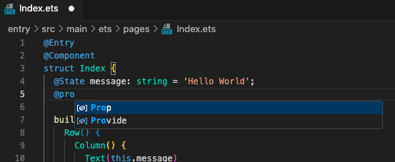

# ArkTs Tools

This is the extension for ArkTs Language. Fast way to create, init, build and run ArkTs project.

## Requirements

After VsCode 1.65.0

## Extension Settings

This extension contributes the following settings:

- `arkts.ohpmPath`: The absolute path to ohpm.
- `arkts.intellisenses.modulesPath`: The absolute path to intellisenses modules roles. WARNING! The Location MUST be a FOLDER and file name MUST like "ets_role_***.json".

## Capture

- Explorer

- High Light

- Intellisenses

## Report Issues

[Click Me](https://gitee.com/michael-eddy/ark-tools/issues)

## Change Log

[Click Me](https://marketplace.visualstudio.com/items/MichaelDing.ark-tools/changelog)

**Enjoy!**