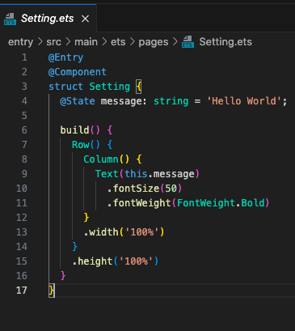
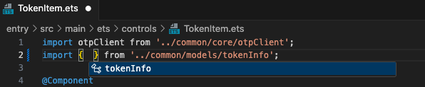
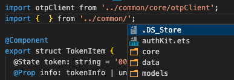

# ArkTs Tools

这是一个 ArkTs/UI 的扩展库. 能够实现快速的创建、初始化、构建和运行你的项目。

## 要求

VsCode 1.75.0 以后版本

## 扩展设置

本扩展包含一下设置项:

- `arktsTools.hosSdkPath`: HarmonyOS SDK 的绝对路径
- `arktsTools.ohosSdkPath`: OpenHarmony SDK 的绝对路径
- `arktsTools.commandToolsPath`: Command Line Tools 的绝对路径
- `arktsTools.codelinterCheckAfterSave`: 在文件、资源、文件夹变更后刷新项目结构
- `arktsTools.codelinterReloadChange`: 保存文件后运行 codelinter
- `arktsTools.intellisensesModulesPath`: intellisenses 规则文件的绝对路径. 注意! 文件名必须以\"ets*role*\*\*\*.json\"开头

## 截图

- 资源管理器
  

- 代码高亮
  

- Intellisenses
  
  
  

## 反馈问题

[点击这里](https://gitee.com/michael-eddy/ark-tools/issues)

## 变更日志

[点击这里](https://marketplace.visualstudio.com/items/MichaelDing.ark-tools/changelog)

**Enjoy!**
